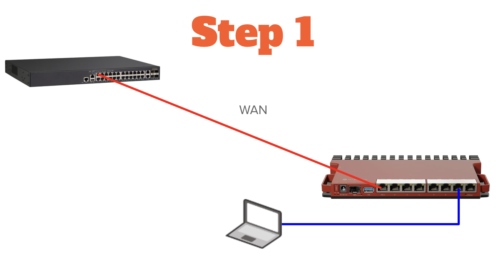

# Lab 01 — Initial Configuration

_Prerequisites: None_

This lab establishes baseline configuration on a factory-fresh MikroTik router (referred to as "MT" throughout this guide).

***

## 1.1 — Physical Setup and First Login

1. Locate the default credentials. Check two places:
   * **Paper guide included in the box** — Often easier to read
   * **Sticker on the bottom of the router** — Take a clear photo; the printed font is small
2. Power on the router and wait approximately 60 seconds for boot.
3. Connect your laptop to the second-to-last copper port — ether7 on L009/RB5009, ether4 on hEX S (from here on out this will be known as the **backdoor port**.) and set your laptop's wired NIC to DHCP.

> **NOTE:** The concept of a "backdoor" port is something that I have come up with to help me when I need to access the router in a hurry. This isn't a MikroTik thing, this is a Jim Palmer thing.

4. Your laptop will receive an IP address in the **192.168.88.0/24** subnet.
5. Open a browser and navigate to **http://192.168.88.1**
6.  Log in using the credentials from step 1.

    > **Note:** MikroTik uses both the letter "O" and the number "0" in passwords, and they look nearly identical. If login fails, check for this.
7. When prompted, create a new password and record it for future reference.
8. Click **Change Now** in the upper left corner.

***

## 1.2 — Basic Configuration

9. You are now viewing the **Quick Set** interface. Scroll to the **System** section at the bottom.
10. Change the **Router Identity** to something meaningful (e.g., `Student-01` or `Lab-Router-01`).
11. Click **Apply Configuration** in the lower right corner.

> **IMPORTANT:** Ensure your router identity and password have been changed from defaults before proceeding.

***

## 1.3 — WAN Connection

12. Connect the WAN port (**ether1**) to your upstream network.
13. The WAN port uses DHCP by default. Look in the **Internet** section near the top of the Quick Set page for an IP address to appear. Record this WAN IP address — you'll need it later.

***

## 1.4 — Firmware Update

14. At the top right of the screen, click from **Quick Set** to **Advanced**.

    > **Note:** Quick Set is a simplified dashboard view. WebFig (also known as Advanced) is the full configuration interface. Both are part of the WebUI — you'll switch between them as needed. The URL bar will still show "webfig" even though the UI label says "Advanced."
15. Navigate to **System** → **Packages**, then click **Check For Updates** in the Actions column on the right-hand side.
16. Verify the **Channel** dropdown is set to **stable**.
17. If updates are available, click **Download & Install** in the Actions column on the right-hand side. The router will reboot automatically (takes a few minutes).

    > **Note:** After rebooting, the WebFig login screen may reappear quickly because it's cached in your browser — but the router isn't ready yet. Login attempts will fail until the reboot fully completes. WinBox (Lab 3) handles this better by showing connection status, but we aren't there yet.
18. After reboot, log back in and verify the update completed by checking **System** → **Resources** for the new version number.

***

Once you have confirmed that you are on the most recent version, you have completed Lab 01, and you are free to move on to Lab 02.
