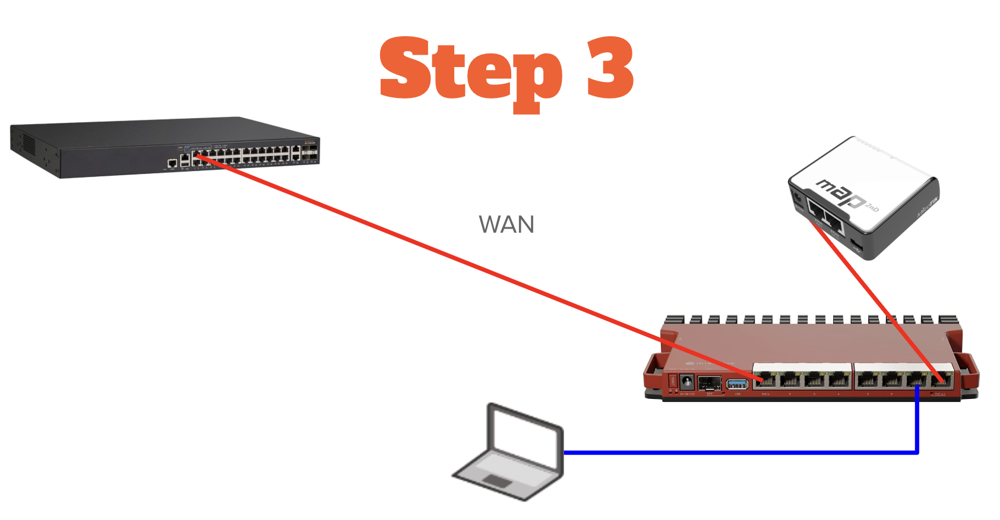
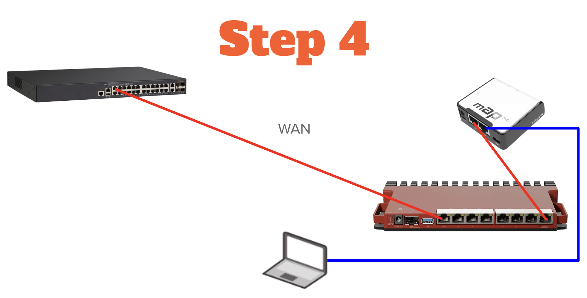
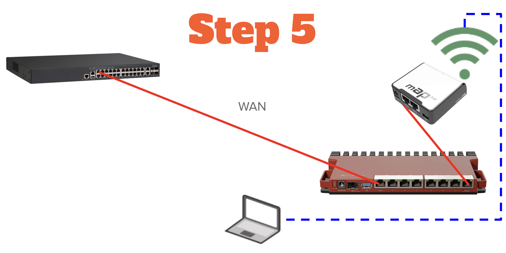
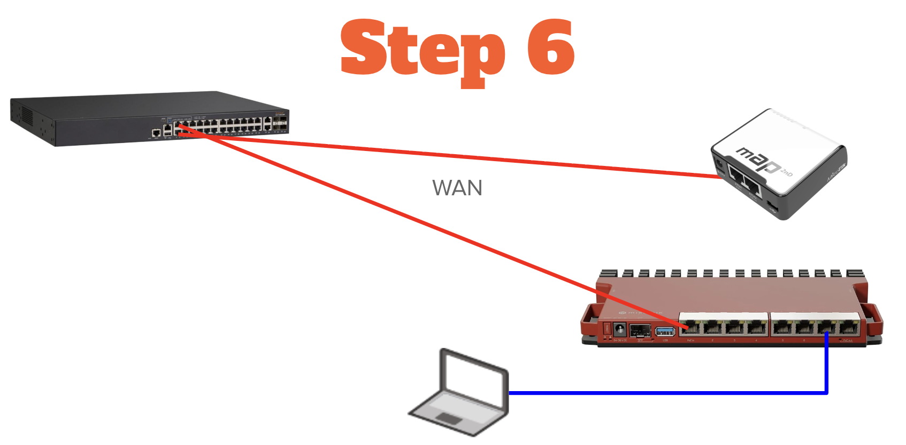

# Lab 13 — mAP Setup

*Prerequisites: Lab 7 (trunk ports configured), Lab 6 (backup completed)*

This lab sets up the mAP as a managed AP extension of your network. We'll configure it with a fallback emergency access method, connect it to your main router's trunk port, set up management Wi-Fi, create an Enterprise SSID for RADIUS testing, and verify the authentication setup from Lab 11.

We're using the mAP 2nd for this lab. It's small, cheap, runs on USB power, and has Wi-Fi built in. The same process works for any RouterOS device — if you want more power, the hAP ax² is a solid upgrade with better Wi-Fi and more RAM, but a little larger.

### What We're Building

| Feature | Purpose |
|---------|---------|
| Fallback config | Emergency access when not connected to main router |
| Trunk connection | Carry all VLANs back to main router |
| Management Wi-Fi | Wireless access to the network on VLAN 255 |
| Enterprise Wi-Fi | WPA2-Enterprise SSID for RADIUS authentication testing |

---

## Lab 13.1 — Initial mAP Access via WinBox



### Physical Connection

1. Connect the mAP's ETH1 port to your main router's expansion port (ether5 on 5-port devices, ether8 on 8-port devices).

   > **Power:** The mAP can be powered via PoE from the router (if your router supports PoE-out — both the L009, hEX S, and RB5009 do), USB, or the included adapter. For this lab, any power source works.

   > **Class connection change:** Plug your mAP into the L009's ether8 (PoE out) port using the 6" jumper cable. The mAP gets power and a network connection from this port. Keep your laptop connected to the L009 backdoor port.

2. Wait for the mAP to boot — the PWR light will go solid green.

### Connect via WinBox

3. Move your laptop's ethernet cable from the main router to **ether2** on the mAP. This gives you direct Layer 2 access to the mAP so WinBox can discover it.



4. Open WinBox on your computer.

5. Click the **Neighbors** tab.

6. You should see the mAP listed (it will show its MAC address and possibly an IP in 192.168.88.x).

7. Click on the mAP's **MAC address** to select it.

   > **Important:** Select the MAC address, not the IP address. At this stage the mAP may not have an IP on your subnet, and connecting by MAC ensures WinBox can reach it regardless.

8. Enter credentials:
   - **Login:** admin
   - **Password:** (leave blank for factory default)

9. Click **Connect**

### Initial Configuration

10. If prompted about the default configuration, click **OK** to keep it for now (we'll reset it shortly).

11. RouterOS will prompt you to change the default password. Set a new password.

    > **Tip:** Use the same password as your main router so you're not juggling multiple credentials during the lab.

12. Navigate to **System** → **Identity**

13. Set the identity to something memorable: `mAP-Remote`

14. Click **Apply** and then **OK**

### Update RouterOS

15. Navigate to **System** → **Packages**

16. Click **Check For Updates**

17. Ensure **Channel** is set to **stable**

18. If updates are available, click **Download & Install**

19. Wait for the mAP to reboot (about 60 seconds).

20. WinBox will attempt to reconnect automatically — close that window. Open a fresh WinBox session, click the **Neighbors** tab, select the mAP by MAC address, and log in with your new password.

---

## Lab 13.2 — Reset to Blank Configuration

The mAP ships with a default configuration designed for "plug and play home router" use — NAT, DHCP server, firewall rules, bridged ports. That's the opposite of what we need (a trunk endpoint with no local NAT or DHCP).

We'll wipe everything and build exactly what we need from scratch.

> **Note:** This will temporarily disconnect your WinBox session. After the reset, reconnect by MAC address — WinBox can discover and connect to MikroTik devices by MAC address even with a completely blank configuration.

### Perform the Reset

1. In WinBox, navigate to **System** → **Reset Configuration**

2. Configure:
   - **No Default Configuration:** ✓ Checked
   - **Do Not Backup:** ✓ Checked

3. Click **Reset Configuration**

4. Click **OK** to confirm.

5. The mAP will reboot with a completely blank configuration. Close the WinBox session — the credentials you just set no longer exist on the device.

### Reconnect After Reset

6. Open WinBox, click the **Neighbors** tab, and select the mAP by MAC address — the same way you connected in Lab 13.1.

7. Connect with:
   - **Login:** admin
   - **Password:** (blank)

8. You'll be prompted to set a password. Set one and record it in your lab notes.

> **Why MAC address still works:** Even with a blank configuration, WinBox can discover and connect to MikroTik devices by MAC address over Layer 2. No IP address or DHCP required.

---

## Lab 13.3 — Build Fallback Configuration

Before we configure the trunk connection, we'll build a minimal "standalone fallback" configuration. This ensures you can always access the mAP even when it's not connected to your main router — useful for troubleshooting or using the mAP as a standalone device while traveling.

We'll use 192.168.89.0/27 for this fallback network — similar to the default 192.168.88.x but clearly distinguishable.

### Create Fallback Bridge

1. Navigate to **Bridge**

2. Click **New**

3. Configure:
   - **Name:** br-fallback
   - **Comment:** Standalone fallback bridge

4. Click **Apply** and then **OK**

### Add Ports to Fallback Bridge

5. From the Bridge window, click the **Ports** tab

6. Click **New**:
   - **Interface:** ether2
   - **Bridge:** br-fallback
   - **Comment:** Fallback ETH2

7. Click **Apply** and then **OK**

   > **Note:** Adding ether2 to the bridge will cause your WinBox session to disconnect. Auto-reconnect will not work here — close the WinBox window and open a fresh session, connecting by MAC address with your updated password.

### Configure Fallback IP Address

8. Navigate to **IP** → **Addresses**

9. Click **New**:
   - **Address:** 192.168.89.1/27
   - **Interface:** br-fallback
   - **Comment:** Fallback management IP

10. Click **Apply** and then **OK**

### Create Fallback DHCP Pool

11. Navigate to **IP** → **Pool**

12. Click **New**:
    - **Name:** fallback-pool
    - **Addresses:** 192.168.89.10-192.168.89.30
    - **Comment:** Fallback DHCP pool

13. Click **Apply** and then **OK**

### Create Fallback DHCP Server

14. Navigate to **IP** → **DHCP Server**

15. Click **New**:
    - **Name:** fallback-dhcp
    - **Interface:** br-fallback
    - **Address Pool:** fallback-pool
    - **Lease Time:** 01:00:00
    - **Add ARP For Leases:** ✓ Checked

16. Click **Apply** and then **OK**

17. In the **DHCP Server** window, click the **Networks** tab

18. Click **New**:
    - **Address:** 192.168.89.0/27
    - **Gateway:** 192.168.89.1
    - **DNS Servers:** 192.168.89.1
    - **Comment:** Fallback network

19. Click **Apply** and then **OK**

### Configure Fallback Wi-Fi

20. Navigate to **Wireless** → **Wireless** → **Security Profiles**

21. Click **New**:
    - **Name:** fallback-psk
    - **Mode:** dynamic keys
    - **Authentication Types:** WPA2 PSK
    - **WPA2 Pre-Shared Key:** [Create a password and record it in your lab notes]

22. Click **Apply** and then **OK**

23. Navigate to **Wireless** → **Wireless** (the submenu, not the top-level menu)

    > **Note:** On RouterOS 7.x you'll see both a **WiFi** menu and a **Wireless** menu. Use **Wireless** → **Wireless** → **WiFi Interfaces** to access the legacy wireless interface where wlan1 lives.

24. Double-click **wlan1** to edit it and click the **Wireless** tab:
    - **Mode:** ap bridge
    - **Band:** 2GHz-only-N
    - **Channel Width:** 20MHz
    - **Frequency:** 2412 (or **auto** if in a class)
    - **SSID:** mAP-Fallback
    - **Security Profile:** fallback-psk
    - **Country:** united states (or your country)

25. Click **Apply** and then **OK**

26. On the **WiFi Interfaces** interface list, select **wlan1** and click **Enable**.

### Add Wi-Fi to Fallback Bridge

27. Navigate to **Bridge** → **Ports**

28. Click **New**:
    - **Interface:** wlan1
    - **Bridge:** br-fallback
    - **Comment:** Fallback Wi-Fi

29. Click **Apply** and then **OK**

### Test Fallback Configuration

30. Set your laptop back to DHCP (if it isn't already).

31. Disconnect and reconnect the ethernet cable to the mAP's ether2 port.

32. Your laptop should receive an IP in the **192.168.89.x** range.

33. WinBox should reconnect automatically to **192.168.89.1**. If it doesn't, open a fresh session and connect by IP or MAC address.

34. You can also test the Wi-Fi:
    - Connect to **mAP-Fallback** SSID using the password you set
    - You should get a 192.168.89.x address
    - You should be able to reach 192.168.89.1

> **What you've built:** A standalone access point with its own DHCP server. This works even when the mAP isn't connected to your main router. Think of it as "emergency mode."
>
> **What's missing:** Internet access. The mAP can hand out addresses and you can reach its management interface, but there's no upstream path to the internet yet. That's what Lab 13.4 builds — the trunk connection back to your main router that carries all your VLANs and provides the gateway.

---

## Lab 13.4 — Configure WAN and Trunk Connection

Now we configure the mAP to get internet from whatever network it's plugged into, and carry tagged VLANs back to your main router when connected via trunk.

> **Class connection change:** Move your laptop's ethernet cable back to the L009 backdoor port. From this point forward, you'll manage the mAP over the network, not by direct cable.



> **All steps in Lab 13.4 are performed on the mAP.** Your main router is already configured from Labs 7-10. Make sure your WinBox session is connected to the mAP (192.168.89.1 or by MAC address), not your main router.

### The Design

The mAP uses ether1 for everything upstream:
- When plugged into your main router's trunk port (ether8/5), it gets a management IP from the VLAN 255 DHCP server and carries tagged VLANs 20/30/40
- When plugged into any other network (hotel, coffee shop, client site), it gets a WAN IP via DHCP from that network

### Create VLAN Interfaces

1. Navigate to **Interfaces**

2. Click **New** → **VLAN**

3. Configure:
   - **Name:** vlan20
   - **VLAN ID:** 20
   - **Interface:** ether1
   - **Comment:** VLAN 20 from trunk

4. Click **Apply** and then **OK**

5. Create the remaining VLANs — open **Terminal** and run:

   ```
   /interface/vlan/add name=vlan30 vlan-id=30 interface=ether1 comment="VLAN 30 from trunk"
   /interface/vlan/add name=vlan40 vlan-id=40 interface=ether1 comment="VLAN 40 from trunk"
   ```

   > **Note:** Do not create a vlan255 sub-interface. VLAN 255 is the native/untagged VLAN on this trunk — ether1 carries it directly without tagging.

### Create Management Bridge

6. Navigate to **Bridge** → **Bridge**

7. Click **New**:
   - **Name:** br-mgmt
   - **Comment:** Management bridge VLAN 255

8. Click **Apply** and then **OK**

9. Click the **Ports** tab

10. Click **New**:
    - **Interface:** ether1
    - **Bridge:** br-mgmt
    - **Comment:** Trunk native VLAN 255

11. Click **Apply** and then **OK**

### Configure WAN DHCP Client

12. Navigate to **IP** → **DHCP Client**

13. Click **New**:
    - **Interface:** br-mgmt
    - **Use Peer DNS:** yes
    - **Use Peer NTP:** yes
    - **Add Default Route:** yes
    - **Comment:** WAN DHCP client

14. Click **Apply** and then **OK**

    > **How this works:** When plugged into your main router's trunk port, br-mgmt receives untagged frames on VLAN 255 and the DHCP client picks up an address in the 10.10.255.x range. When plugged into any other network, it picks up whatever address that network hands out. The default route updates automatically in both cases.

### Configure DNS

> **⚑ Flag:** If internet access isn't working after completing Lab 13.4, come back and verify this step first — DNS is a common culprit.

15. Navigate to **IP** → **DNS**

16. Set **Servers:** 10.10.255.1

17. Click **Apply** and then **OK**

### Test Trunk Connectivity

18. Plug the mAP's ether1 into your main router's expansion port (ether8/5).

19. Navigate to **IP** → **DHCP Client** and verify the status shows **bound** with an address in the **10.10.255.x** range.

20. Navigate to **Tools** → **Ping**

21. Ping **10.10.255.1** (your main router) — this should succeed.

22. Ping **8.8.8.8** to verify internet access through the main router.

> **If pings fail:** Check that ether5 on your main router has VLAN 255 configured as the native/untagged VLAN with PVID 255 and VLAN filtering enabled on the bridge (Lab 7.4).

---

## Lab 13.5 — Configure Management Wi-Fi on VLAN 255

The fallback Wi-Fi (mAP-Fallback) is for emergency standalone access. Now we'll add a second SSID that puts clients on the management VLAN (255), giving them access to the full network when the mAP is connected to the main router.

### Create Management Wi-Fi Security Profile

1. Navigate to **Wireless** → **Wireless** → **Security Profiles**

2. Click **New**:
   - **Name:** mgmt-security
   - **Mode:** dynamic keys
   - **Authentication Types:** WPA2 PSK
   - **WPA2 Pre-Shared Key:** [Create a strong password — different from fallback]

3. Click **Apply** and then **OK**

### Create Virtual AP for Management

4. Navigate to **Wireless** → **WiFi Interfaces**

5. Click **New** → **Virtual**

6. Configure:
   - **Name:** wlan2
   - **Mode:** ap bridge
   - **Master Interface:** wlan1
   - **SSID:** Student[#]
   - **Security Profile:** mgmt-security

7. Click **Apply** and then **OK**

### Add Management SSID to Management Bridge

8. Navigate to **Bridge** → **Ports**

9. Click **New**:
    - **Interface:** wlan2
    - **Bridge:** br-mgmt
    - **Comment:** Management Wi-Fi

10. Click **Apply** and then **OK**

### Test Management Wi-Fi

11. On your laptop or phone, look for the **Student[#]** SSID you created in step 6 above.

12. Connect using the password you created.

13. You should receive an IP address in the **10.10.255.x** subnet (from the main router's DHCP server for VLAN 255).

14. Verify you can access **10.10.255.1** (main router). You should also be able to reach the mAP at whatever IP it received from the DHCP server.

---

## Lab 13.6 — Configure Enterprise Wi-Fi (WPA2-Enterprise)

Now we'll add a third SSID configured for WPA2-Enterprise authentication. This SSID uses the RADIUS server (User Manager) you configured in Lab 11 instead of a pre-shared key.

### Create Enterprise Wi-Fi Security Profile

1. Navigate to **Wireless** → **Wireless** → **Security Profiles**

2. Click **New**:
   - **Name:** enterprise-security
   - **Mode:** dynamic keys
   - **Authentication Types:** WPA2 EAP
   - **EAP Methods:** passthrough
   - **RADIUS EAP Accounting:** ✓ Checked (optional)

3. Click **Apply** and then **OK**

### Configure RADIUS Client on mAP

The mAP needs to know where to send RADIUS authentication requests.

4. Navigate to **RADIUS**

5. Click **New**:
   - **Service:** wireless
   - **Address:** 10.10.255.1 (your main router's VLAN 255 IP)
   - **Secret:** [the same shared secret from Lab 11.3]
   - **Authentication Port:** 1812
   - **Accounting Port:** 1813
   - **Comment:** Main router User Manager

6. Click **Apply** and then **OK**

### Create Virtual AP for Enterprise

7. Navigate to **Wireless** → **WiFi Interfaces**

8. Click **New** → **Virtual**

9. Configure:
   - **Name:** wlan3
   - **Mode:** ap bridge
   - **Master Interface:** wlan1
   - **SSID:** Student#-Enterprise
   - **Security Profile:** enterprise-security

10. Click **Apply** and then **OK**

### Add Enterprise SSID to Management Bridge

11. Navigate to **Bridge** → **Ports**

12. Click **New**:
    - **Interface:** wlan3
    - **Bridge:** br-mgmt
    - **Comment:** Enterprise Wi-Fi (RADIUS)

13. Click **Apply** and then **OK**

> **Why br-mgmt?** The mAP forwards the RADIUS packets to your main router over the trunk. The authenticated client gets an IP on VLAN 255 from the main router's DHCP server — the same as the management SSID, but authenticated with enterprise credentials instead of a PSK.

---

## Lab 13.7 — Test RADIUS Authentication

Now that the mAP has an Enterprise SSID, it's time to test the RADIUS setup you built in Lab 11.

> **Class connection change:** Disconnect your laptop from the L009 backdoor port. Connect to the mAP's Enterprise Wi-Fi SSID to test RADIUS authentication. After testing, reconnect to the L009 backdoor port.



### Test EAP-PEAP (Username/Password)

1. On a test device (phone or laptop), connect to the **MikroTik-Enterprise** SSID.

2. When prompted:
   - **EAP Method:** PEAP
   - **Phase 2 Authentication:** MSCHAPv2
   - **Identity:** user2@mikrotik.test
   - **Password:** [the password you created in Lab 11.3]
   - **CA Certificate:** Do not validate (for lab testing) or install the CA cert

3. The device should authenticate and receive an IP address in the **10.10.255.x** range.

### Test EAP-TLS (Certificate)

For EAP-TLS, you need to export and install the client certificate on your test device. The MikroTik app makes this much easier than manual file transfer.

**Using the MikroTik App (Recommended for phones/tablets):**

4. Install the MikroTik app on your phone (available for iOS and Android).

5. Connect to your main router through the app.

6. Navigate to **System** → **Certificates**

7. Select the client certificate (user1-client)

8. Export the certificate — the app handles the transfer and installation directly to your device's certificate store.

9. Connect to the **Student#-Enterprise** SSID and select the installed certificate.

**Manual Export (for laptops or devices without the app):**

10. On your main router, navigate to **System** → **Certificates**

11. Select the client certificate (user1-client)

12. Click **Export**

13. Configure:
    - **Type:** PKCS12
    - **Export Passphrase:** [create a passphrase]

14. Click **Export**

15. Navigate to **Files** and download the .p12 file.

16. Transfer the .p12 file to your device and install it.

17. Connect to the **Student#-Enterprise** SSID using the certificate.

### Verify in User Manager

18. On your main router, navigate to **User Manager** → **Sessions**

19. You should see active sessions for authenticated users.

20. Navigate to **User Manager** → **Users** and click on a user to see their session history.

> **What just happened:** Your phone authenticated to a Wi-Fi network using enterprise credentials. The mAP forwarded the RADIUS request over the trunk to your main router's User Manager, which validated the credentials and told the mAP to grant access. This is the same architecture used in corporate networks with thousands of users — you just built it on two devices that fit in your pocket.

---

## Lab 13.8 — Backup mAP Configuration

Before proceeding, back up the mAP configuration.

### Create Binary Backup

1. Navigate to **Files**

2. Click **Backup**

3. Configure:
   - **Name:** mAP-full-config
   - **Password:** [Optional encryption password]

4. Click **Backup**

5. The file appears in the file list. Right-click and **Download** to your laptop.

### Create RSC Export

6. Open **New Terminal**

7. Run:
   ```
   /export file=mAP-export
   ```

8. Navigate to **Files**

9. Download the `mAP-export.rsc` file to your laptop.

> **Why both?** The .backup file is a complete binary backup for restoring to this device. The .rsc file is human-readable and can be used to recreate the configuration on a different device — which leads us to Lab 18 (Scripting).

---

## Lab 13 Summary

At the end of Lab 13, you have:
- mAP accessible via fallback Wi-Fi for emergency management
- mAP connected to your main router's trunk port
- Management Wi-Fi on VLAN 255
- Enterprise Wi-Fi (WPA2-Enterprise) with RADIUS authentication
- RADIUS authentication verified (EAP-PEAP and EAP-TLS)
- Full backup of the mAP configuration
