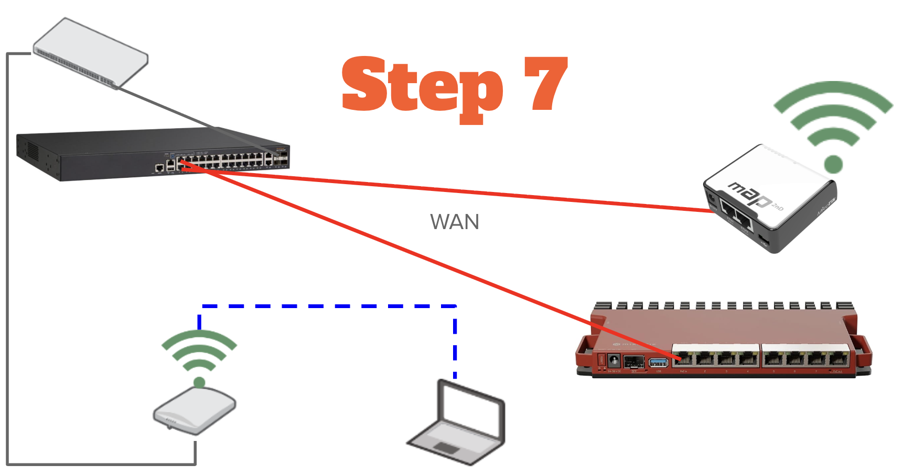

# Lab 17 — mAP Advanced (WireGuard & RoMON)

*Prerequisites: Lab 13 (mAP Setup), Lab 12 (WireGuard Server), Lab 14 (WireGuard Clients)**

This lab extends your mAP with a WireGuard tunnel back to your main router and enables RoMON for remote management through the tunnel.

## Lab 17.1 — Configure WireGuard Tunnel

Now we configure the mAP to tunnel back to your main router via WireGuard. This is what makes the mAP a travel router — plug it into any network with internet access and it tunnels home automatically.

### Prerequisites

Before starting, verify:
- The mAP has internet access (Lab 13.4 complete, ping 8.8.8.8 works)
- Your main router's WireGuard server is running on port 51820 (Lab 12)
- **UDP port 51820 is port-forwarded** on your upstream router (the router that provides internet to your main router) to your main router's WAN IP. Without this, the tunnel cannot form when the mAP is on an external network.

### Two WinBox Sessions

Lab 18.1 requires simultaneous access to both the mAP and the main router. Before starting:

1. Move your laptop cable from the mAP to your **main router's backdoor port** (ether8 on the L009, ether4 on the hEX S, 192.168.88.1)
2. Open a WinBox session to your **main router** via Neighbors or IP
3. Open a **second WinBox session** to the mAP by typing **10.10.255.x** (the IP the mAP received from the main router's DHCP) directly into the Connect To field — it won't appear in Neighbors from this connection
   > If you can't find the IP address for your mAP, on your main router click on **IP** → **DHCP Server** → **Leases** and the mAP will be listed there. This is the IP address to connect to.
5. Log in with your mAP password

Keep both sessions open throughout this lab.

### Create WireGuard Interface

> **You are on the mAP** for steps 1-8.

1. Navigate to **WireGuard**

2. Click **New**:
   - **Name:** wg-home
   - **Listen Port:** 51820
   - **MTU:** 1420

3. Click **Apply** and then **OK**

4. Double-click on **wg-home** to view it

5. Copy the **Public Key** field and record it in your lab notes — you'll need it in step 13.

### Configure WireGuard IP

6. Navigate to **IP** → **Addresses**

7. Click **New**:
   - **Address:** 10.255.255.2/24
   - **Interface:** wg-home
   - **Comment:** WireGuard tunnel IP

8. Click **Apply** and then **OK**

### Add Peer on mAP (pointing to main router)

9. Navigate to **WireGuard** → **Peers** tab

10. Click **New**:
    - **Interface:** wg-home
    - **Public Key:** 
       - Switch to your **main router** WinBox session → navigate to **WireGuard** → double-click **wg-server** → copy the **Public Key** field. This is the **interface** public key, not a peer key.
       - Switch back to your mAP and paste the copied key into the **Public Key** window.
    - **Endpoint:** 
       - Switch to your **main router** WinBox session → navigate to **IP** → **Cloud** → copy the **DNS Name** field.
       - Switch back to your mAP and paste it, adding `:51820` at the end.
    - **Allowed Address:** 10.255.255.0/24, 10.10.0.0/16
    - **Persistent Keepalive:** 00:00:25
    - **Comment:** Main router

11. Click **Apply** and then **OK**

### Add Peer on Main Router (pointing to mAP)

> **Switch to your main router WinBox session** for steps 12-14.

12. Navigate to **WireGuard** → **Peers**

13. Click **New**:
    - **Interface:** wg-server
    - **Public Key:** [mAP's public key from step 5]
    - **Allowed Address:** 10.255.255.2/32
    - **Comment:** mAP remote

14. Click **Apply** and then **OK**

### Test WireGuard Tunnel

> **Back on the mAP** for the remaining steps.

15. Navigate to **Tools** → **Ping**

16. Ping **10.255.255.1** (main router's WireGuard IP)

17. Navigate to **WireGuard** → **Peers**

18. Check the **Last Handshake** column — it should show a recent timestamp (within the last minute) and non-zero Rx/Tx counters.

> **If no handshake:**
> - Verify the public keys match on both sides — the mAP peer must have the **wg-server interface** public key, not a peer public key
> - Verify UDP 51820 is port-forwarded on your upstream router to your main router's WAN IP
> - Check that your main router's firewall allows UDP 51820 inbound (Lab 12.3)
> - If the mAP is on the same network as the main router, NAT hairpinning may prevent the tunnel from forming — test with the mAP on a separate internet connection



> **Class connection change:** Now that your WireGuard tunnel is verified, it's time to prove it works across networks. Unplug the mAP's jumper from the L009 ether8. Plug the mAP into your second Ethernet cable (the black 25' cable going to the class switch). 
>
> Watch what happens:
> 1. The tunnel re-establishes automatically — the mAP is on a different subnet but WireGuard doesn't care
> 2. If you test RADIUS, it breaks — the mAP's RADIUS packets now come from the WireGuard IP (10.255.255.x) instead of the trunk IP
> 3. Fix it by adding the WireGuard subnet as a RADIUS client on the L009:
> ```
> /tool/user-manager/router/add address=10.255.255.0/24 shared-secret=yourradiussecret name=wireguard-clients
> ```
>
> Three lessons in one cable move: WireGuard portability, RADIUS source addressing, and why network architecture decisions matter.

> ⚠️ **Read carefully.** If you get stuck here, re-read the steps above. The answer is in the instructions.

---

## Lab 17.2 — Configure RoMON

RoMON (Router Management Overlay Network) lets you manage multiple MikroTik devices through a single connection. Once configured, you can access any RoMON-enabled device on the network without needing direct IP connectivity to it.

### What RoMON Does

Think of RoMON as a Layer 2 management tunnel between MikroTik devices. When you connect to any device in the RoMON network:
- You can "discover" all other RoMON-enabled devices
- You can open a management session to any discovered device
- This works even if you don't have IP routing to that device

**Use case:** You're connected to the mAP via the fallback Wi-Fi. Through RoMON, you can manage the main router without knowing its IP address or having a route to it — as long as there's a Layer 2 path (the trunk) between them.

### Enable RoMON on mAP

1. Navigate to **Tools** → **RoMON**

2. Click the **Settings** button (or just click in the main RoMON window)

3. Configure:
   - **Enabled:** ✓ Checked
   - **Secrets:** Enter the same RoMON secret you created on the main router in Lab 3. Check your lab notes if you don't remember it.
   - **ID:** Leave as default (MAC-based)

4. Click **Apply**

### Configure RoMON Ports

5. Click the **Ports** tab and verify the default entry shows **Interface: all** — this means RoMON will operate on every interface. No changes needed.

### Enable RoMON on Main Router

6. Connect to your main router via WinBox

7. Navigate to **Tools** → **RoMON**

12. Click **Settings**:
    - Verify the following:
       - **Enabled:** ✓ Checked
       - **Secrets:** [Populated]

16. Click the **Ports** tab and verify the default entry shows **Interface: all** — this means RoMON will operate on every interface. No changes needed.

17. Click **Apply** and then **OK** if any changes were made.

### Discover Devices via RoMON

17. On either device in WinBox, click the **Discover** tab (or button)

19. You should see both devices listed with their MAC addresses and identities.

20. To connect to a device: select it and click **Connect** — a new WinBox session opens to that device.

### Using RoMON from WinBox Neighbors

Even simpler — WinBox's Neighbors tab can use RoMON:

1. Open WinBox

2. Connect to either device normally

3. Click **Neighbors** in the left menu

4. Devices reachable via RoMON appear here

5. Double-click any device to open a new WinBox window to it

This means: connect to the mAP via fallback Wi-Fi, then manage your main router through RoMON without any additional network configuration.

---

## Lab 17.3 — Backup mAP Configuration

Before proceeding, back up the mAP configuration.

### Create Binary Backup

1. Navigate to **Files**

2. Click **Backup**

3. Configure:
   - **Name:** mAP-full-config
   - **Password:** [Optional encryption password]

4. Click **Backup**

5. The file appears in the file list. Right-click and **Download** to your laptop.

### Create RSC Export

6. Open **New Terminal**

7. Run:
   ```
   /export file=mAP-export
   ```

8. Navigate to **Files**

9. Download the `mAP-export.rsc` file to your laptop.

> **Why both?** The .backup file is a complete binary backup for restoring to this device. The .rsc file is human-readable and can be used to recreate the configuration on a different device — which leads us to Lab 18 (Scripting).

---


## Lab 17 Summary

At the end of Lab 18, you have:
- WireGuard tunnel from mAP to main router
- RoMON enabled for remote device management
- Updated backup of the mAP configuration
